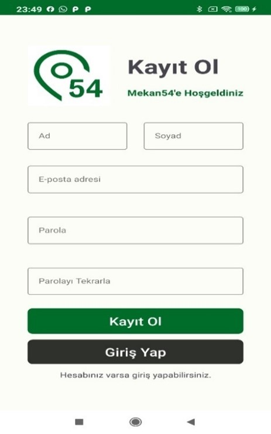
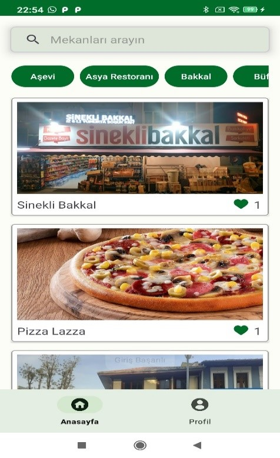
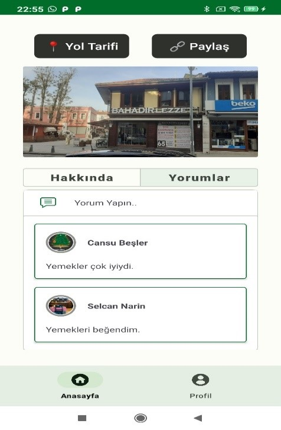
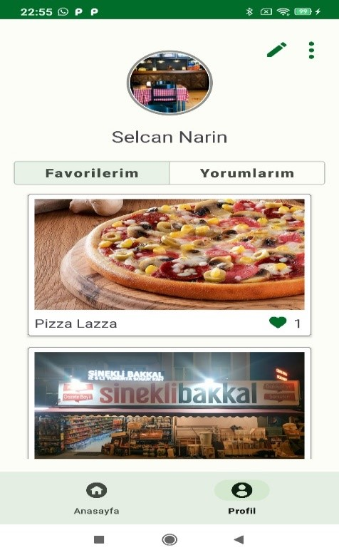
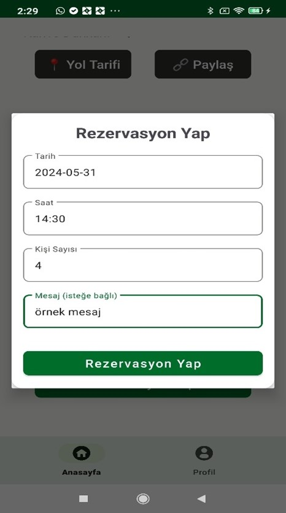
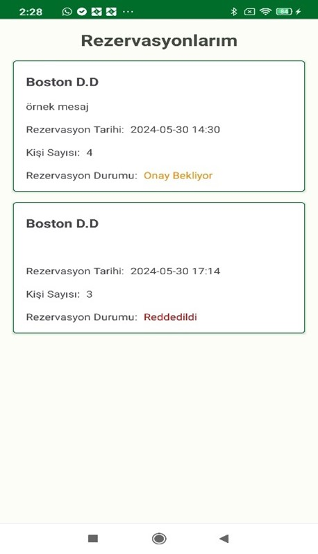
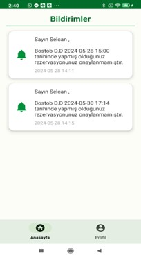
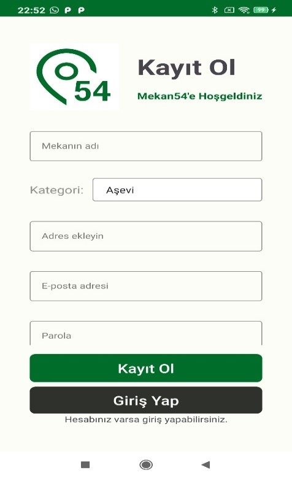
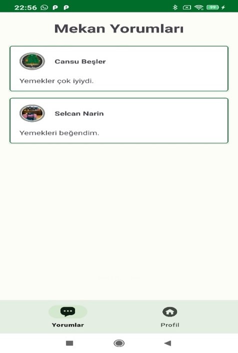
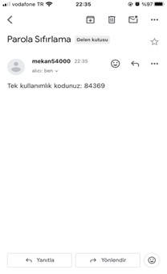

# Mekan54

Bu proje, kullanıcıların çeşitli mekanları keşfetmelerine, yorum yapmalarına, rezervasyon yapmalarına ve favori mekanlarını yönetmelerine olanak tanıyan bir platformdur. Aynı zamanda mekan sahipleri, işletmeleri hakkında detaylı bilgileri güncelleyebilir ve kullanıcı yorumlarını takip edebilirler.

## Özellikler

### Kullanıcı Ekranları

#### 1. Kullanıcı Kayıt Ekranı
Kullanıcı, ad, soyad, e-posta adresi, parola ve parola tekrarı gibi bilgileri girerek kayıt işlemini tamamlar. Giriş bilgilerinde uygunluk kontrolleri yapılır ve kayıt başarılı ise kullanıcı giriş ekranına yönlendirilir.

#### 2. Kullanıcı Ana Ekranı
Bu ekran, kullanıcıya tüm mekanları kategorilere ayrılmış bir şekilde listeleyerek sunar. Kullanıcı, kategorilere ve isimlere göre arama yapabilir.

#### 3. Mekan Detay Sayfası
Mekan hakkında detaylı bilgilerin yer aldığı bu sayfada, kullanıcı mekanın yol tarifi, genel bilgiler ve mekanla ilgili yapılan yorumları görebilir. Ayrıca, kullanıcı bu sayfa üzerinden mekana ait yeni yorumlar ekleyebilir ve isteğe bağlı olarak mekanı paylaşabilir.

#### 4. Kullanıcı Profil Ekranı
Bu ekran, kullanıcının favori mekanlarını ve kendi yorumlarını görüntüleyebileceği bir alan sunar. Aynı zamanda kullanıcı, kişisel bilgilerini güncelleyebilir.

#### 5. Rezervasyon İşlemleri
Kullanıcılar, rezervasyon yapma ve mevcut rezervasyonlarını görüntüleme işlemlerini bu ekranlardan gerçekleştirebilirler.

#### 6. Bildirimler Ekranı
Kullanıcılar, mekanlardan veya sistemden gelen bildirimleri bu ekran üzerinden takip edebilirler.

### Mekan Sahibi Ekranları
#### 1. Kayıt Ekranı
Mekan sahibi, işletmesinin detaylarını içeren önemli bilgileri giriş yaparak sisteme kaydeder. Bu adımda eksik veya hatalı bilgi girilmesi durumunda, kullanıcıya anında geri bildirim sağlanır ve kayıt işlemi doğrulandığında giriş ekranına yönlendirilir.

#### 2. Mekan Yorumları Ekranı
İşletme sahipleri, kendi mekanlarına gelen yorumları bu ekran üzerinden inceleyebilir ve değerlendirebilirler. Bu sayede işletmelerine dair geri bildirimleri takip etmek daha kolay hale gelir.

#### 3. Mekan Profil Ekranı
Mekanın detaylı profil bilgileri ve görselleri, mekan sahibine kullanıcı dostu bir arayüzle sunulur. Profil güncelleme ikonu aracılığıyla mekan sahibi, işletme bilgilerini anında düzenleme şansına sahiptir.

#### 4. Mekan Güncelleme Ekranı
İşletme sahipleri, mekanlarıyla ilgili bilgileri ve fotoğrafları güncelleyebilirler. Maksimum dört adet fotoğraf yükleyebilen mekan sahipleri, işletmelerini en iyi şekilde temsil etmeye olanak tanır.

#### 5. Rezervasyon İşlemleri
Rezervasyonun durumu otomatik olarak kullanıcıya bildirim olarak gönderilir.

### Ortak Ekranlar

#### 1. Parola Yenileme Ekranları
Bu ekranda kullanıcının veya mekan sahibinin e-posta adresi istenir. Böyle bir e-posta adresi olması halinde, güvenlik kodu gönderilir ve kod doğrulama ekranı açılır. Kod doğru girildiğinde, parola yenileme ekranı açılır.

